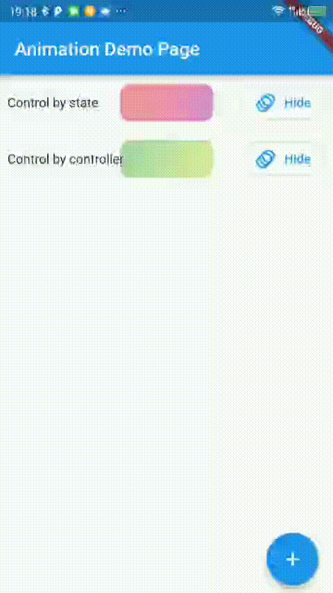

<center>Combined Animation Widget</center>

<center>

[](https://pub.dartlang.org/packages/combined_animation)

</center>

A combined animation widget, contains alignment, opacity, transform, size for enter and leave a widget.

## Features

- [x] alignment animation.
- [x] opacity animation.
- [x] transform animation.
- [x] size animation.

- [x] enter animation config.
- [x] leave animation config.

- [x] dissmiss size animation

## Preview



## Getting started

```shell
flutter pub add combined_animation
```

## Usage

```dart
CombinedAnimation(
    state: willRemove?
        ? AnimationType.end
        : AnimationType.start,
    onLeaved: (size) {
        
    },
    onDissmiss:(){
        doRemove(item);
        setState(() {});
    },
    config: AnimationConfig.fadeAndZoomIn,
    child: child,
)
```

## Produce

