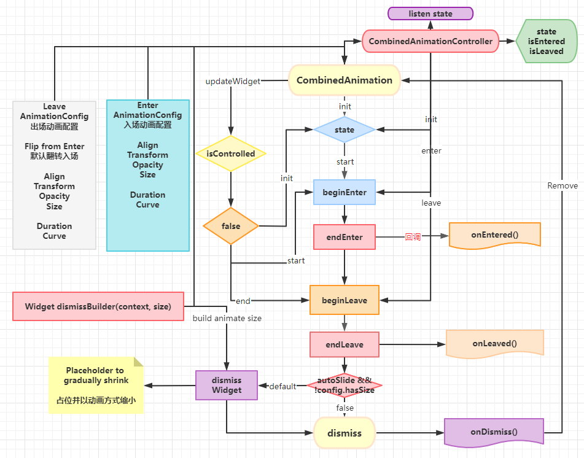

<center>Combined Animation Widget</center>

<center>

[](https://pub.dartlang.org/packages/combined_animation)

</center>

A combined animation widget, contains alignment, opacity, transform, size for enter and leave a widget.

## Features

- ✅ alignment animation.
- ✅ opacity animation.
- ✅ transform animation.
- ✅ size animation.

- ✅ enter animation config.
- ✅ leave animation config.

- ✅ dismiss size animation

## Preview


## Getting started

```shell
flutter pub add combined_animation
```

## Usage

```dart
CombinedAnimation(
    state: willRemove?
        ? AnimationType.end
        : AnimationType.start,
    controller: CombinedAnimationController(),
    onEntered: () {
        
    },
    onLeaved: () {
        
    },
    dismissBuilder: (context,size){
        // you can return a size box with size amination to diy dismiss animation
        // or will generate a default one
    }
    onDismiss:(){
        // if you dont remove it
        // you can call controller.enter to show it again
        setState(() {
            doRemove(item);
        });
    },
    config: AnimationConfig.fadeAndZoomIn,
    child: child,
)
```

## Produce

